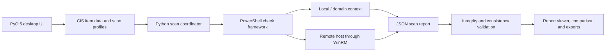

<!-- markdownlint-disable MD013 -->

# Windows Security Auditor

> A bilingual desktop application for auditing Windows security settings against
> the included CIS Microsoft Windows Server 2022 Benchmark data, reviewing
> findings, and optionally applying mapped baseline settings.

[繁體中文簡介](#繁體中文簡介) · [Features](#features) ·
[Installation](#installation) · [Usage](#usage) ·
[Remote scanning](#remote-scanning) · [Security notes](#security-and-safety)

## Overview

Windows Security Auditor is a PyQt5 application that combines a graphical audit
workflow with PowerShell-based configuration checks. The v5.4 source contains
436 CIS items, a matching set of 436 check scripts, report comparison and export
tools, reusable scan profiles, and English and Traditional Chinese interfaces.

The project is primarily built around the **CIS Microsoft Windows Server 2022
Benchmark v4.0.0** included in the repository. It can run checks locally,
against the current domain-policy context, or on a remote Windows host through
PowerShell Remoting.

> [!IMPORTANT] The application source is available directly in the repository
> root. `project-001(v5.4).7z` is retained through Git LFS only as an optional
> snapshot of the original packaged project; extracting it is not required for
> normal development or use.

<!-- Separate the GitHub alert blocks. -->

> [!CAUTION] Auditing is mainly read-only, but **Apply CIS Defaults**, baseline
> restore, undo, WinRM configuration, and firewall actions change system
> configuration. Use an elevated account, save a baseline first, and validate
> all changes in a non-production environment.

## Features

- 436 mapped CIS L1 and L2 checks backed by individual PowerShell scripts.
- Local, domain-context, and remote scan modes.
- Search, filter, bulk selection, and reusable item profiles.
- English and Traditional Chinese (`zh_HK`) user interfaces and help content.
- Structured JSON reports with scan metadata, actual and expected values,
  timestamps, and a SHA-256 result-integrity hash.
- Report summary charts, filtering, printing, previous-report comparison, and
  export to DOCX, XLSX, CSV, and TXT.
- Custom PowerShell check import from a file or pasted script content.
- Optional mapped remediation with pre-change backup, undo, saved baseline,
  restore, logs, and HTML/CSV output.
- Post-scan consistency, fact, status, integrity, and traceability checks for
  generated report data.
- Environment checks for operating system, Python version, architecture, and
  administrator status.

## Supported environment

| Component          | Recommended / current scope                                                                            |
| ------------------ | ------------------------------------------------------------------------------------------------------ |
| Primary target     | Windows Server 2022                                                                                    |
| Included benchmark | CIS Microsoft Windows Server 2022 Benchmark v4.0.0                                                     |
| Python             | 3.12 or 3.13; the included project was developed with Python 3.13                                      |
| PowerShell         | Windows PowerShell available as `powershell.exe`                                                       |
| Interface          | English and Traditional Chinese                                                                        |
| Privileges         | Administrator recommended for complete local audits; required for remediation and system configuration |
| Remote transport   | WinRM / PowerShell Remoting                                                                            |

The code includes detection paths for Windows Server 2012, 2012 R2, 2016, 2019,
2022, and 2025. It also exposes a restricted audit interface on Windows 10 and
Windows 11. However, only the Windows Server 2022 benchmark source is included
in this repository, so other operating systems should not be treated as fully
validated benchmark targets.

## How it works



Each selected item points to a script under `scripts/checks/`. Built-in scripts
run through `scripts/cis_check_framework.ps1` and `data/cis_mapping.json`. The
Python scanner normalizes the script result, adds benchmark metadata and a
remediation suggestion, calculates the report integrity hash, saves the JSON
report, and runs post-scan validation.

## Installation

### 1. Install prerequisites

Install the following on the Windows machine that will run the application:

- Python 3.12 or 3.13
- Git

Git LFS and 7-Zip are optional and only needed for the archived snapshot.

### 2. Clone the repository

```powershell
git clone https://github.com/iskshadow195563/2022-cis-scan.git
Set-Location .\2022-cis-scan
```

### 3. Create a clean virtual environment

Create a project-local environment instead of installing dependencies globally:

```powershell
py -3.13 -m venv .venv-local
.\.venv-local\Scripts\Activate.ps1
python -m pip install --upgrade pip
python -m pip install -r requirements.txt
```

If PowerShell policy prevents activation, use the environment's interpreter
directly:

```powershell
.\.venv-local\Scripts\python.exe -m pip install --upgrade pip
.\.venv-local\Scripts\python.exe -m pip install -r requirements.txt
```

The application dependencies are PyQt5, python-docx, matplotlib, psutil,
openpyxl, and requests.

### Optional: download the original archive

The source tree above is already ready to use. If you specifically need the
original v5.4 snapshot, install [Git LFS](https://git-lfs.com/) and
[7-Zip](https://www.7-zip.org/), then run:

```powershell
git lfs install
git lfs pull
7z x '.\project-001(v5.4).7z' -o'.\archive-v5.4'
```

The snapshot contains machine-specific virtual environments, caches, logs, and
old reports. Do not copy those generated files back into the source tree.

## Running the application

From an activated environment:

```powershell
python .\check_os.py
python .\main.py
```

Or, while the environment is active, launch:

```powershell
.\start.bat
```

For remediation or the most complete local scan, open PowerShell or Command
Prompt with **Run as administrator** before starting the application.

## Usage

### Run an audit

1. Select **Check Environment** and review the detected OS, Python version,
   architecture, and administrator status.
2. Choose an output directory. The default is the repository's `results` folder.
3. Search for individual controls or select all L1, all L2, both levels, or all
   visible controls.
4. Choose **Local**, **Domain**, or **Remote** scan mode.
5. Select **Run Audit** and wait for the selected scripts to finish.
6. Review the report window, filter findings, compare with a previous report,
   print, or export the results.

The Domain mode runs checks in the current machine and domain-policy context; it
does not automatically enumerate every host in a domain.

### Result statuses

| Status                   | Meaning                                                            |
| ------------------------ | ------------------------------------------------------------------ |
| `Pass`                   | The observed value matches the mapped recommendation.              |
| `Fail`                   | The observed value does not match the recommendation.              |
| `Not Supported`          | The check is not applicable or supported on the target.            |
| `Script Missing`         | No usable script was found for the selected item.                  |
| `Script Error` / `Error` | The script failed, timed out, or returned an infrastructure error. |

Do not interpret infrastructure errors as compliance failures or successes.
Review `scan_debug.log` and rerun the affected checks after correcting the
environment.

### Profiles

The profile manager can save a named set of selected item codes with a target OS
and description. Profiles can be loaded, edited, deleted, imported from JSON, or
exported for reuse.

### Custom PowerShell checks

On supported Windows Server targets, use **Import PowerShell Script** to select
a `.ps1` file or paste script content. Custom checks appear with a `PS:` code
and can be included in a scan profile.

A custom script should write either:

- JSON containing `Status`, `Detail`, and optionally `Actual`; or
- a useful value on standard output and an exit code of `0` for pass or non-zero
  for fail.

Built-in and remote scripts have a 120-second execution timeout. Only import
scripts that you have reviewed and trust.

## Remote scanning

Remote mode uses `Invoke-Command -ComputerName <target>` and the current Windows
identity. The account running the application must be authorized on the remote
host.

Before scanning:

1. Enable PowerShell Remoting on the appropriate systems.
2. Confirm name resolution or IP connectivity.
3. Configure WinRM listeners and firewall rules according to your organization's
   policy.
4. In workgroup or IP-based scenarios, configure `TrustedHosts` narrowly.
5. Verify the connection with `Test-WSMan -ComputerName <target>`.

The built-in **Remote Configuration** dialog can manage TrustedHosts, test ping
and WinRM, enable remoting, and add firewall rules for ports 5985 and 5986.
These actions change the host's security configuration. In particular, do not
enable Basic authentication or broad TrustedHosts entries unless they are
explicitly required and protected by an approved transport and credential
policy.

## Applying CIS defaults

The **Apply CIS Defaults** workflow is available on supported server targets and
requires Administrator privileges. Depending on the mapping, it can change local
security policy, account policy, user rights, registry values, firewall
profiles, services, and audit policy.

Available actions include:

- **Save Baseline** — exports the current security policy and HKLM registry
  baseline.
- **Apply** — backs up relevant policies, applies selected mapped controls, and
  writes a report.
- **Undo** — restores the backup when the PowerShell workflow is given the
  original apply-report directory.
- **Restore Baseline** — restores a previously saved baseline and creates a
  pre-restore backup.

Recommended workflow:

1. Take a system or VM snapshot.
2. Select **Save Baseline**.
3. Apply a small, reviewed set of controls in a test environment.
4. Inspect `cis_apply.log` and the generated HTML/CSV report.
5. Reboot if required by the affected policies.
6. Run a new audit and validate application, domain, and network behavior.

Not every scan mapping is necessarily safe or complete for every role. Review
the selected controls and `data/cis_mapping.json` before applying them.

### Undo note for v5.4

The underlying script expects `-ReportDir` to be the original
`cis_apply_YYYYMMDD_HHMMSS` directory containing `backup/`. The v5.4 GUI can
create a new timestamped directory when **Undo** is selected, so verify the
target path instead of relying on the button alone. From an elevated PowerShell
prompt, the explicit form is:

```powershell
powershell.exe -NoProfile -ExecutionPolicy Bypass `
  -File .\scripts\cis_apply.ps1 -Undo `
  -ReportDir .\results\cis_apply_YYYYMMDD_HHMMSS
```

Keep the original apply-report directory until the change has been fully
validated.

## Reports and generated files

By default, generated files are written under `results/`:

| File                                 | Purpose                                           |
| ------------------------------------ | ------------------------------------------------- |
| `report_YYYYMMDD_HHMMSS.json`        | Canonical audit report.                           |
| `scan_debug.log`                     | Script execution and scan diagnostics.            |
| `hallucination_YYYYMMDD_HHMMSS.json` | Post-scan consistency and traceability findings.  |
| `cis_apply_*` directories            | Remediation backups, logs, and HTML/CSV reports.  |
| `baseline/`                          | Saved baseline data used by the restore workflow. |

The JSON report records scan mode, target, timestamps, item counts, summary
totals, actual and expected values where available, and a SHA-256 integrity hash
over the result code, status, and detail fields.

Reports may contain hostnames, IP addresses, policy values, and other
security-relevant details. Store and share them accordingly.

## Project layout

The repository contains the following source structure:

```text
2022-cis-scan/
├── main.py                         # Application entry point
├── check_os.py                     # OS compatibility pre-check
├── start.bat                       # Windows launcher
├── requirements.txt                # Runtime Python dependencies
├── core/                           # Scanner, parsers, validation and managers
├── gui/                            # PyQt5 windows, dialogs, styles and themes
├── scripts/
│   ├── cis_check_framework.ps1     # Built-in check execution framework
│   ├── cis_apply.ps1               # Baseline apply, backup and restore workflow
│   └── checks/                     # 436 individual PowerShell checks
├── data/
│   ├── cis_items.json              # Parsed benchmark item metadata
│   ├── cis_mapping.json            # Check and remediation mappings
│   └── help/                       # Localized HTML help
├── locales/                        # English and Traditional Chinese UI strings
├── profiles/                       # Saved scan profiles
├── results/                        # Reports, logs and backups
└── tests/                          # Unit and integration-oriented tests
```

## Development and testing

Install the runtime and test tools in a clean environment:

```powershell
py -3.13 -m venv .venv-dev
.\.venv-dev\Scripts\Activate.ps1
python -m pip install -r requirements.txt
python -m pip install pytest pytest-cov
```

Run the test suite:

```powershell
$env:QT_QPA_PLATFORM = 'offscreen'
python -m pytest -q
```

Generate a coverage report:

```powershell
python -m pytest --cov=core --cov=gui --cov-report=term-missing
```

The v5.4 source currently contains 31 test modules and 188 test functions. The
included coverage artifact reports 73% statement coverage; regenerate it after
making changes because the recorded value may be stale.

For OS-detection tests, the code recognizes values such as `server:2022`,
`server:2019`, `client:win11`, and `client:win10` through the
`OS_PROFILE_OVERRIDE` environment variable. Do not use this override to bypass
production compatibility checks.

## Troubleshooting

### The optional archive is only about 130 bytes

The source code is still available and usable. If you also want the optional
archive, install Git LFS and run:

```powershell
git lfs install
git lfs pull
```

### Python dependencies fail to install

Use Python 3.12 or 3.13, create a fresh virtual environment, upgrade pip, and
retry `python -m pip install -r requirements.txt`.

### A scan reports missing scripts

Confirm that `scripts\checks\` contains the check scripts. Start the application
from the repository root so relative paths resolve correctly.

### Remote checks fail

Run `Test-WSMan`, verify the firewall and WinRM listener, confirm the current
user has remote authorization, and review TrustedHosts or domain authentication.
See `results\scan_debug.log` for the executed item and error context.

### The application closes after the OS check

The compatibility guard did not recognize the current system as a supported
target. Run the project on Windows Server 2022 for the intended benchmark
workflow.

## Security and safety

- Run scans and remediation only on systems you own or are explicitly authorized
  to assess.
- Review imported scripts and mappings before execution.
- Treat generated reports and backups as sensitive data.
- Prefer HTTPS WinRM with appropriate certificates and domain authentication
  where possible.
- Test remediation on a disposable VM or staging server before production use.
- Keep an out-of-band recovery path in case security-policy changes disrupt
  login or networking.
- An audit result is evidence from this tool, not a guarantee of security,
  certification, or full CIS compliance.

## License and benchmark notice

This repository does not currently include an open-source license. Without an
explicit license, no additional rights to copy, modify, or redistribute the
project are granted by default.

CIS benchmark documents and related material may be subject to separate Center
for Internet Security terms. Review those terms before redistributing benchmark
content. This project is not presented as an official CIS product or
certification.

## 繁體中文簡介

Windows Security
Auditor 是一個以 PyQt5 和 PowerShell 製作的 Windows 安全審查工具。v5.4 原始碼已直接放在儲存庫根目錄，內含 436 個 CIS 檢查項目及對應腳本，主要依據隨附的
**CIS Microsoft Windows Server 2022 Benchmark
v4.0.0**。程式支援本機、目前網域原則環境及 WinRM 遠端掃描，並可輸出 JSON、DOCX、XLSX、CSV 及 TXT 報告。

使用前只需複製儲存庫，並以 Python 3.12 或 3.13 建立全新的
`.venv-local`。`project-001(v5.4).7z`
只保留作原始封裝快照，正常使用不必解壓。完整掃描建議以系統管理員身份執行；「套用 CIS 預設值」、還原基線、復原、WinRM 及防火牆設定均會修改系統，務必先建立快照及儲存基線，並在非生產環境測試。
